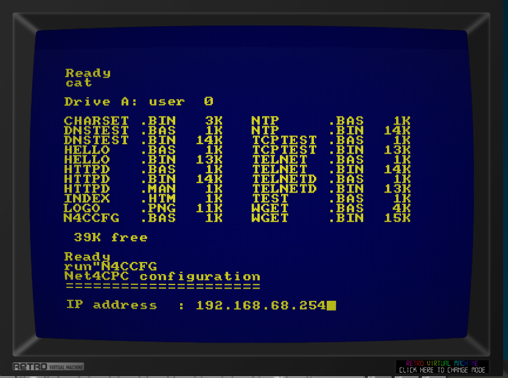

# cpc-sdcc

C development for the Amstrad CPC using [SDCC](https://sdcc.sourceforge.net/), targeting the Z80.  
Includes a W5100S Ethernet driver for the [Net4CPC](https://www.cpcwiki.eu/index.php/Net4CPC) hardware,
with TCP, UDP/DNS support, an HTTP file downloader (wget), an NTP time client, an ANSI telnet client,
a telnet daemon that hooks the CPC firmware to serve an interactive BASIC session over TCP,
and a static HTTP server that pre-loads files into iRAM1024 expansion RAM and serves them
concurrently over four TCP sockets.

Also supports the [M4 WiFi card](https://github.com/M4Duke/) as a second network backend
(compile with `-DNET_M4`).

See [DEVELOPMENT.md](DEVELOPMENT.md) for API reference, hardware register maps, protocol
details, calling convention notes, and memory layout.

## Prerequisites

- **SDCC 4.x** with Z80 target (`sdcc`, `sdasz80`, `makebin`)  
  Set `SDCC_BIN` in each build script to your SDCC `bin/` directory.

## Project structure

```
src/
  crt0.s          Startup stub: saves BASIC SP, sets SP=0xBFF0, calls main(), returns to BASIC
  cpcbios.h       CPC firmware wrappers (print, cls, key input, mode, timer)
  amsdos.h        AMSDOS file output (cas_out_open/char/close/abandon)
  amsdos_in.h/c   AMSDOS file input (cas_in_open/readbyte/close)
  w5100.h/c       W5100S Ethernet chip driver
  netinit.h/c     Network initialisation from N4C.CFG
  net.h/c         TCP socket API (single socket)
  net_multi.h/c   TCP socket API (multi-socket, for httpd)
  udp.h/c         UDP socket API
  dns.h/c         DNS A-record resolver
  cpcdetect.h/c   CPC model detection and expansion RAM probe
  bank.h/c        iRAM1024 DK'Tronics/Yarek banking driver
  amsdos_wrap.py  Adds 128-byte AMSDOS binary header to a raw binary

  M4 WiFi card (compile with -DNET_M4):
  m4io.h/c        Low-level M4 I/O and ROM slot management
  net_m4.c        TCP socket API (implements net.h) using M4 commands
  dns_m4.c        DNS via C_NETHOSTIP (implements dns.h)
  udp_m4.c        UDP stub — M4 firmware is TCP only; UDP not supported
  netinit_m4.c    No-op net_init_from_file() — M4 is self-configured

examples/
  hello/    Prints "Hello, CPC!" and returns to BASIC
  tcptest/  Opens a TCP connection and performs an HTTP GET
  dnstest/  Resolves a hostname via DNS and prints the IP
  wget/     HTTP file downloader — prompts for URL, saves file to disk
  ntp/      NTP time client — UDP NTP (W5100S) or HTTP Date header (M4)
  telnet/   ANSI/VT100 telnet client — Mode 2 (80×25), Code Page 437,
            hardware scroll, full ESC[ cursor/colour support
  telnetd/  Telnet daemon — mirrors BASIC I/O over TCP via firmware patches
  httpd/    Static HTTP server — loads files into iRAM1024, serves on 4 sockets
```

## Building

Each example has its own `build.sh` that produces binaries for all supported
targets in a single run:

| Output directory | Target hardware      | BASIC loader  |
|------------------|----------------------|---------------|
| `bin/`           | ULIfAC / real floppy | `NAME.BAS`    |
| `bin/albireo/`   | Albireo (Unidos)     | `NAMEA.BAS`   |
| `bin/m4/`        | M4 WiFi card         | `NAME.BAS`    |

```bash
cd examples/tcptest && ./build.sh
cd examples/dnstest && ./build.sh
cd examples/wget    && ./build.sh
cd examples/ntp     && ./build.sh
cd examples/telnet  && ./build.sh
cd examples/telnetd && ./build.sh
cd examples/httpd   && ./build.sh
cd examples/hello   && ./build.sh
```

Copy all files from the relevant output directory to a CPC disk and `RUN` the `.BAS` loader.

**telnet** requires three files on the disk: `TELNET.BIN`, `CHARSET.BIN`, and (for W5100S) `N4C.CFG`.

**httpd** requires `HTTPD.BIN`, `N4C.CFG`, `HTTPD.MAN`, and all web files listed in the manifest.

### Ready-to-use disk images

Prebuilt standard CPC DSK images are provided in `images/`:

| Image | Contents |
|---|---|
| `n4c_tools.dsk` | All ULIfAC/floppy binaries + `N4CCFG.BAS` |
| `m4_tools.dsk`  | M4 WiFi card binaries |

Load in any CPC emulator (WinAPE, JavaCPC, etc.) or write to a Gotek USB drive.

Rebuild both DSK images with:

```bash
./make_dsk.sh   # requires iDSK from github.com/reidrac/cpc-mastering
```

## Network configuration — N4C.CFG

W5100S builds read network settings from `N4C.CFG` on the CPC disk:

```
IP=192.168.1.100
MASK=255.255.255.0
GW=192.168.1.1
DNS=8.8.8.8
```

The file must use **CR+LF line endings**.  MAC address is hardcoded as `DE:AD:BE:EF:00:FF`.

**ULIfAC disk:** run `N4CCFG.BAS` first — it prompts for your network settings and writes `N4C.CFG`.

## M4 WiFi card

The M4 card is pre-configured via its own web interface or `|netset` RSX command.
No `N4C.CFG` is needed — just `RUN "TCPTEST.BAS"` etc. from the `bin/m4/` disk.

The M4 build pass uses `-DNET_M4` and links the M4 driver files instead of the W5100S equivalents.
All three ported examples (tcptest, ntp, telnet) are confirmed working on hardware.

## Acknowledgements

- **[llopis/amstrad-diagnostics](https://github.com/llopis/amstrad-diagnostics)** — CPC model detection signatures and RAM test patterns used as reference for `src/cpcdetect.c`.
